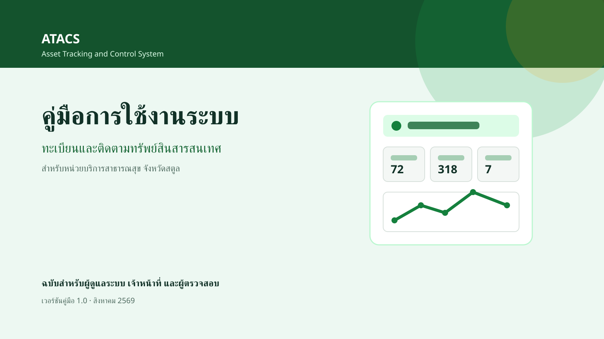
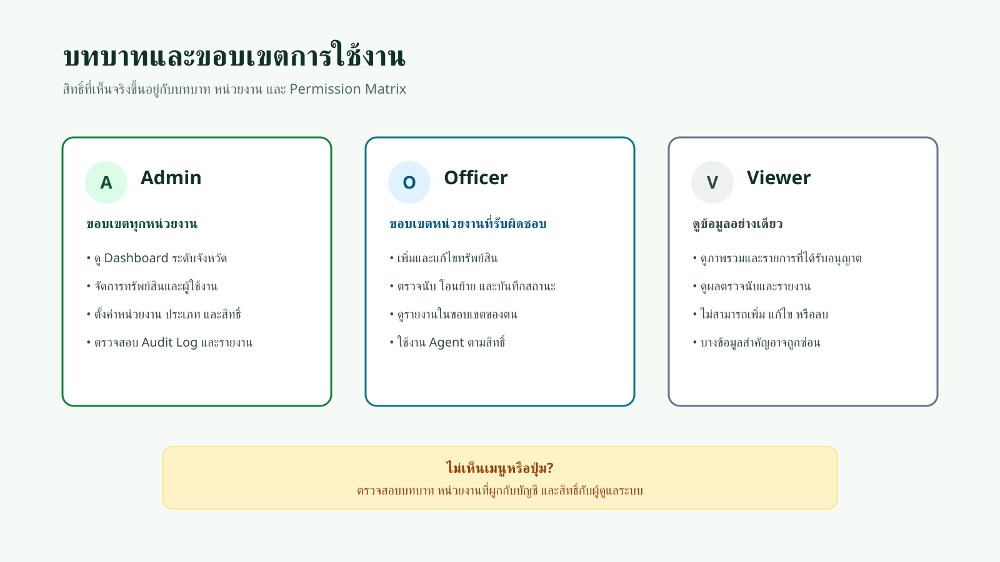
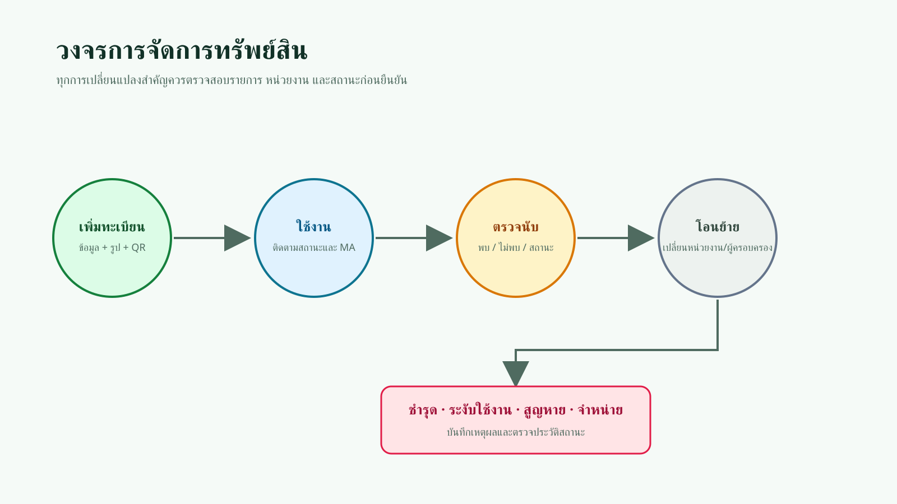
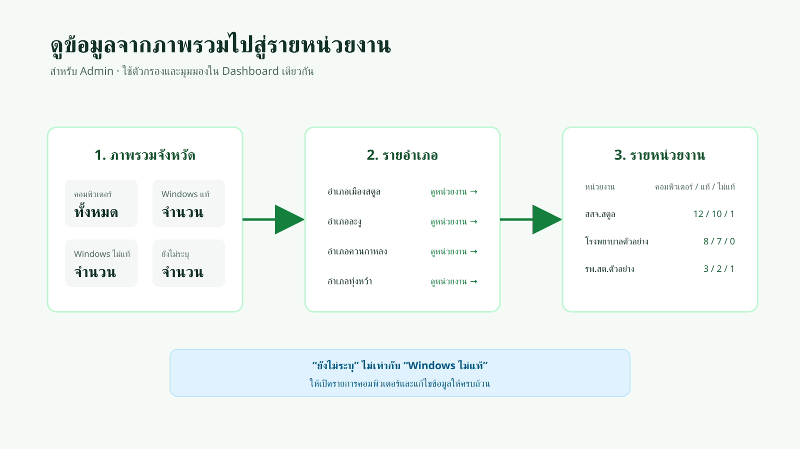
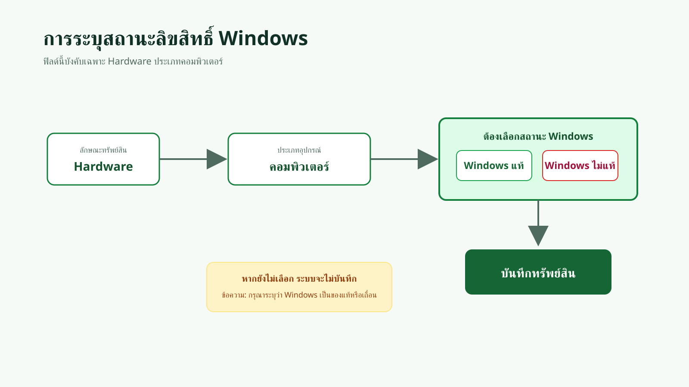
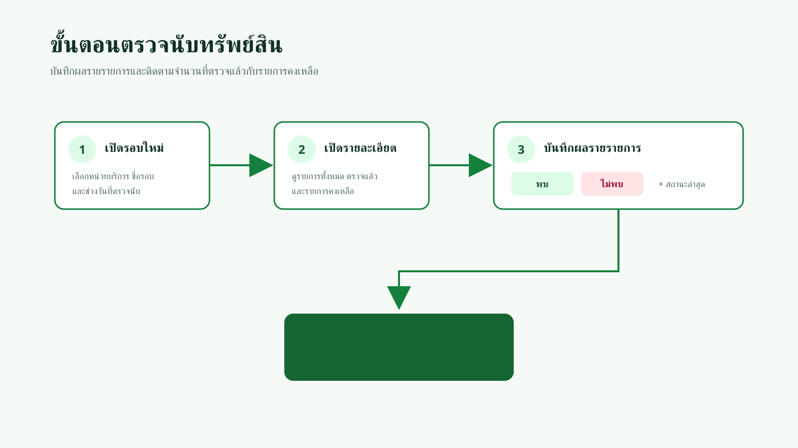
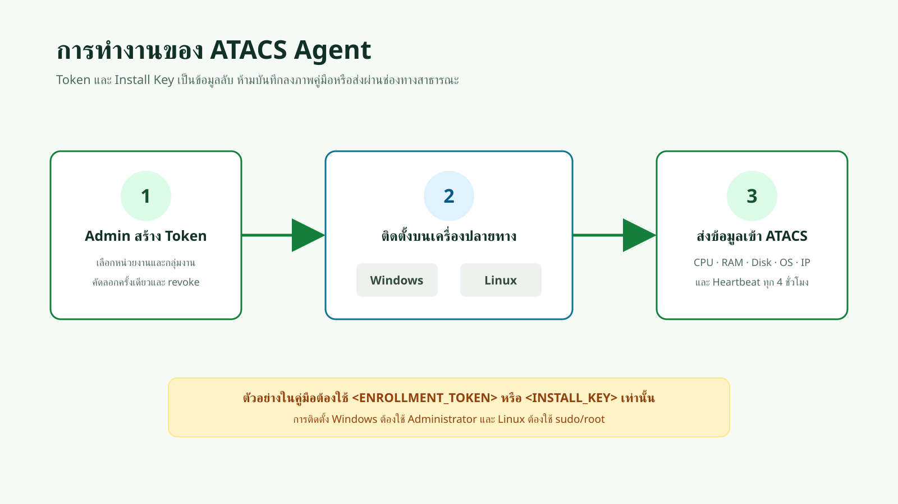

# คู่มือการใช้งานระบบ ATACS



| รายการ | รายละเอียด |
|---|---|
| ชื่อระบบ | ATACS — Asset Tracking and Control System |
| ชื่อเอกสาร | คู่มือการใช้งานระบบทะเบียนและติดตามทรัพย์สินสารสนเทศ |
| เวอร์ชันคู่มือ | 1.0 |
| วันที่ปรับปรุง | 4 สิงหาคม 2569 |
| กลุ่มผู้ใช้ | Admin, Officer และ Viewer |
| หน่วยงานเจ้าของระบบ | `[กรอกชื่อหน่วยงาน]` |
| URL ระบบ | `[กรอก URL ระบบ]` |
| ติดต่อผู้ดูแล | `[กรอกช่องทางติดต่อ]` |

> **หมายเหตุเกี่ยวกับภาพ:** ภาพในคู่มือฉบับนี้เป็นภาพประกอบเชิงกระบวนการ ไม่ใช่ภาพหน้าจอจริง ข้อความและชื่อเมนูในขั้นตอนอ้างอิงจากระบบปัจจุบัน ตำแหน่งที่ระบุ `[ภาพหน้าจอจริง]` ควรเติมภาพจากระบบทดสอบที่ปกปิดข้อมูลแล้วก่อนเผยแพร่ฉบับสมบูรณ์

## ประวัติการแก้ไข

| เวอร์ชัน | วันที่ | รายละเอียด |
|---|---|---|
| 1.0 | 4 สิงหาคม 2569 | จัดทำคู่มือฉบับแรก ครอบคลุมทะเบียนทรัพย์สิน สถานะ Windows Dashboard ตรวจนับ โอนย้าย จำหน่าย รายงาน Agent และงานผู้ดูแลระบบ |

## สารบัญ

1. [รู้จักระบบและบทบาทผู้ใช้](#1-รู้จักระบบและบทบาทผู้ใช้)
2. [เข้าสู่ระบบและเริ่มต้นใช้งาน](#2-เข้าสู่ระบบและเริ่มต้นใช้งาน)
3. [Dashboard ภาพรวม](#3-dashboard-ภาพรวม)
4. [ค้นหาและดูรายการทรัพย์สิน](#4-ค้นหาและดูรายการทรัพย์สิน)
5. [เพิ่มและแก้ไขทรัพย์สิน](#5-เพิ่มและแก้ไขทรัพย์สิน)
6. [ตรวจนับทรัพย์สิน](#6-ตรวจนับทรัพย์สิน)
7. [โอนย้ายทรัพย์สิน](#7-โอนย้ายทรัพย์สิน)
8. [จำหน่าย ชำรุด สูญหาย และระงับใช้งาน](#8-จำหน่าย-ชำรุด-สูญหาย-และระงับใช้งาน)
9. [แผนที่และรายงาน](#9-แผนที่และรายงาน)
10. [ATACS Agent](#10-atacs-agent)
11. [งานผู้ดูแลระบบ](#11-งานผู้ดูแลระบบ)
12. [การแก้ปัญหาเบื้องต้น](#12-การแก้ปัญหาเบื้องต้น)
13. [ภาคผนวก](#13-ภาคผนวก)

---

## 1. รู้จักระบบและบทบาทผู้ใช้

ATACS ใช้บันทึกและติดตามทรัพย์สินสารสนเทศของหน่วยบริการสาธารณสุข ตั้งแต่การขึ้นทะเบียน การตรวจนับ การโอนย้าย การเปลี่ยนสถานะ การติดตามสัญญาบำรุงรักษา ไปจนถึงการรายงานระดับหน่วยงาน อำเภอ และจังหวัด



### 1.1 บทบาท

| บทบาท | ขอบเขตโดยทั่วไป | ข้อจำกัดสำคัญ |
|---|---|---|
| Admin | ดูภาพรวมทุกหน่วยงาน จัดการข้อมูลและการตั้งค่าระบบ | ความสามารถแต่ละรายการยังขึ้นกับ Permission Matrix |
| Officer | จัดการข้อมูลในหน่วยงานหรือขอบเขตที่ได้รับมอบหมาย | ไม่สามารถดำเนินการกับหน่วยงานนอกขอบเขต |
| Viewer | ดูข้อมูลที่ได้รับอนุญาต | ไม่สามารถเพิ่ม แก้ไข ลบ โอนย้าย หรือเปลี่ยนสถานะ |

> **เคล็ดลับ:** หากไม่เห็นเมนูหรือปุ่ม ให้ตรวจสอบบทบาท หน่วยงานที่ผูกกับบัญชี และสิทธิ์กับผู้ดูแลระบบก่อนแจ้งปัญหา

### 1.2 วงจรการจัดการทรัพย์สิน



ข้อมูลสำคัญ เช่น หน่วยงาน ผู้ครอบครอง สถานที่ติดตั้ง และสถานะ ควรได้รับการปรับปรุงทุกครั้งที่มีการเปลี่ยนแปลง เพื่อให้การตรวจนับและรายงานมีความถูกต้อง

---

## 2. เข้าสู่ระบบและเริ่มต้นใช้งาน

### 2.1 เข้าสู่ระบบด้วย Username และรหัสผ่าน

**ก่อนเริ่ม:** ต้องมีบัญชีที่ได้รับอนุมัติและเปิดใช้งานแล้ว

1. เปิด URL ของระบบ ATACS
2. เลือกการเข้าสู่ระบบด้วย Username
3. กรอก **Username**
4. กรอก **รหัสผ่าน**
5. คลิก **เข้าสู่ระบบ**
6. ตรวจสอบว่าระบบพาไปหน้า **ภาพรวม**

> `[ภาพหน้าจอจริง 01: หน้าเข้าสู่ระบบ โดยใช้บัญชีตัวอย่างและปกปิดข้อมูลรับรอง]`

### 2.2 เข้าสู่ระบบด้วย ThaiD หรือ Google

1. ที่หน้าเข้าสู่ระบบ เลือก **เข้าสู่ระบบด้วย ThaiD** หรือ **เข้าสู่ระบบด้วย Gmail**
2. ดำเนินการยืนยันตัวตนกับผู้ให้บริการ
3. หากมีบัญชีอยู่แล้ว ระบบจะนำเข้าสู่ ATACS
4. หากยังไม่มีบัญชี ระบบจะนำไปหน้าสมัครสมาชิก
5. กรอกข้อมูลให้ครบและส่งคำขอ
6. รอผู้ดูแลระบบอนุมัติก่อนเข้าสู่ระบบ

> **คำเตือน:** ห้ามบันทึกรหัสผ่าน รหัส OTP หรือข้อมูลยืนยันตัวตนลงในภาพคู่มือ

### 2.3 ตรวจสอบโปรไฟล์และหน่วยงาน

1. เปิดเมนูโปรไฟล์ของผู้ใช้
2. ตรวจสอบชื่อ อีเมล Username บทบาท และหน่วยงาน
3. หากยังไม่มีหน่วยงาน ให้ติดต่อ Admin เพื่อผูกบัญชีกับหน่วยงานก่อนทำงานทรัพย์สิน

### 2.4 ออกจากระบบ

1. เปิดเมนูบัญชีผู้ใช้
2. เลือก **ออกจากระบบ**
3. ตรวจสอบว่าระบบกลับไปหน้าเข้าสู่ระบบ

---

## 3. Dashboard ภาพรวม

หน้า **ภาพรวม** ใช้ติดตามสถานการณ์ล่าสุดและเปิดงานต่อจากตัวเลขสรุป โดยข้อมูลที่เห็นขึ้นอยู่กับบทบาทและตัวกรอง

### 3.1 ใช้ตัวกรอง

1. ไปที่เมนู **ภาพรวม**
2. เลือก **กลุ่ม** หากต้องการจำกัดประเภทหน่วยงาน
3. เลือก **หน่วยงานในอำเภอ**
4. เลือก **หน่วยงาน** เมื่อต้องการดูเฉพาะแห่ง
5. คลิก **กรองข้อมูล**
6. ตรวจสอบป้ายเงื่อนไขที่แสดงใต้ตัวกรอง
7. คลิก **ล้างตัวกรอง** เมื่อต้องการกลับไปดูภาพรวมทั้งหมด

> `[ภาพหน้าจอจริง 02: Dashboard และตัวกรอง ปกปิดชื่อบุคคล/IP ที่อาจปรากฏ]`

### 3.2 อ่านตัวเลขสรุป

- **หน่วยงาน:** จำนวนหน่วยงานในขอบเขตปัจจุบัน
- **ทรัพย์สินรวม:** จำนวน Hardware และ Software
- **พร้อมใช้งาน:** จำนวนและร้อยละของทรัพย์สินสถานะ Active
- **MA ใกล้หมดอายุ:** รายการที่หมดอายุภายในช่วงแจ้งเตือน
- **รายการชำรุด:** รายการที่ควรตรวจสอบหรือส่งซ่อม

### 3.3 ดูคอมพิวเตอร์และสถานะ Windows สำหรับ Admin



1. เลื่อนมาที่ส่วน **ภาพรวมคอมพิวเตอร์และลิขสิทธิ์ Windows**
2. อ่านยอด **คอมพิวเตอร์ทั้งหมด**
3. เปรียบเทียบ **Windows แท้**, **Windows ไม่แท้** และ **ยังไม่ระบุ**
4. เลือก **รายอำเภอ** เพื่อดูภาพรวมแต่ละอำเภอ
5. คลิกชื่ออำเภอหรือเลือก **รายหน่วยงาน** เพื่อดูรายละเอียดระดับหน่วยงาน
6. ใช้ตัวกรองด้านบนเพื่อจำกัดกลุ่ม อำเภอ หรือหน่วยงาน

> **สำคัญ:** “ยังไม่ระบุ” หมายถึงข้อมูลยังไม่ครบ ไม่ได้หมายความว่าเป็น Windows ไม่แท้

> `[ภาพหน้าจอจริง 03: ตารางรายอำเภอ และภาพ 04: ตารางรายหน่วยงาน]`

---

## 4. ค้นหาและดูรายการทรัพย์สิน

### 4.1 ค้นหาและกรอง

1. ไปที่เมนู **รายการทรัพย์สิน**
2. กรอกชื่อ เลขทะเบียน ประเภท หรือ Serial Number ในช่องค้นหา
3. เลือกตัวกรองที่ต้องการ เช่น สถานะ กลุ่มครุภัณฑ์ Hardware/Software ประเภทอุปกรณ์ อำเภอ หน่วยงาน หรือกลุ่มงาน
4. เลือกการเรียงลำดับและจำนวนรายการต่อหน้า
5. คลิกค้นหาหรือส่งตัวกรอง
6. คลิก **ล้างตัวกรอง** เพื่อเริ่มใหม่

### 4.2 เปิดรายละเอียด

1. คลิกชื่อหรือแถวของทรัพย์สิน
2. ตรวจสอบข้อมูลในส่วนต่อไปนี้:
   - หน่วยงาน อำเภอ ผู้รับผิดชอบ และตำแหน่งติดตั้ง
   - กลุ่มครุภัณฑ์ ลักษณะทรัพย์สิน และประเภทอุปกรณ์
   - ยี่ห้อ Serial Number ระบบปฏิบัติการ และสถานะ Windows
   - Private IP และ Public IP หากได้รับสิทธิ์
   - รูปภาพ ข้อมูลจัดซื้อ สัญญา MA และประวัติสถานะ
3. ใช้ปุ่ม **แก้ไข** เมื่อมีสิทธิ์
4. ดาวน์โหลดหรือพิมพ์ QR Code เมื่อมีปุ่มในหน้า

> **คำเตือน:** ห้ามเผยแพร่ภาพหน้ารายละเอียดที่มี IP, Serial Number, QR Code หรือชื่อผู้รับผิดชอบจริง

---

## 5. เพิ่มและแก้ไขทรัพย์สิน

### 5.1 เพิ่มทรัพย์สิน

**สิทธิ์ที่ต้องมี:** `assets.create`

1. ไปที่ **รายการทรัพย์สิน**
2. คลิก **+ เพิ่มทรัพย์สิน**
3. เลือก **หน่วยงาน**
4. เลือก **กลุ่มงาน** หากหน่วยงานมีการกำหนดกลุ่มงาน
5. กรอก **ชื่อทรัพย์สิน** และข้อมูลสำคัญอื่น
6. เลือก **กลุ่มครุภัณฑ์**
7. เลือก **ลักษณะทรัพย์สิน** เป็น Hardware หรือ Software
8. เลือก **ประเภททรัพย์สิน / อุปกรณ์**
9. กรอกข้อมูลผู้รับผิดชอบ ตำแหน่งติดตั้ง Serial Number การจัดซื้อ และ MA ตามข้อมูลจริง
10. แนบรูปภาพเมื่อมี
11. ตรวจสอบฟิลด์ที่มีเครื่องหมาย `*`
12. คลิก **เพิ่มทรัพย์สิน**

> `[ภาพหน้าจอจริง 05: ฟอร์มเพิ่มทรัพย์สิน โดยใช้ข้อมูล SAT-DEMO-0001]`

### 5.2 กฎสถานะลิขสิทธิ์ Windows



เมื่อเลือก **Hardware** และประเภทอุปกรณ์เป็นคอมพิวเตอร์ ระบบจะแสดงฟิลด์ **สถานะลิขสิทธิ์ Windows** และบังคับให้เลือก:

- **Windows แท้ (มีลิขสิทธิ์ถูกต้อง)** หรือ
- **Windows ไม่แท้/เถื่อน (ไม่มีลิขสิทธิ์ถูกต้อง)**

หากไม่เลือก ระบบจะแสดงข้อความให้ระบุว่า Windows เป็นของแท้หรือเถื่อนและจะยังไม่บันทึก

> `[ภาพหน้าจอจริง 06: ครอปฟิลด์สถานะลิขสิทธิ์ Windows และตัวเลือกทั้งสอง]`

### 5.3 แก้ไขทรัพย์สิน

**สิทธิ์ที่ต้องมี:** `assets.update`

1. เปิดหน้ารายละเอียดทรัพย์สิน
2. คลิก **แก้ไข**
3. ปรับข้อมูลที่ต้องการ
4. หากเป็นคอมพิวเตอร์เดิมที่สถานะ Windows เป็น “ยังไม่ระบุ” ให้เลือกสถานะให้ครบ
5. ตรวจสอบหน่วยงาน Serial Number สถานะ และข้อมูล MA
6. คลิก **บันทึกการแก้ไข**
7. ตรวจสอบข้อมูลใหม่ในหน้ารายละเอียดและประวัติสถานะ

### 5.4 ข้อความตรวจสอบที่พบบ่อย

| ข้อความ/อาการ | วิธีแก้ไข |
|---|---|
| กรุณาเลือกหน่วยงาน | เลือกหน่วยงานจากรายการ ไม่พิมพ์ข้อความอิสระ |
| กรุณาเลือกกลุ่มงาน | เลือกกลุ่มงานของหน่วยงานที่เลือก |
| เลขทะเบียนมีในระบบแล้ว | ตรวจสอบรายการเดิมหรือใช้เลขทะเบียนที่ถูกต้อง |
| Serial Number มีอยู่แล้วในหน่วยงาน | ตรวจสอบอุปกรณ์ซ้ำก่อนสร้างรายการใหม่ |
| วันที่ซื้อเกินวันที่ปัจจุบัน | แก้วันที่ซื้อ/รับมอบ |
| วันสิ้นสุดสัญญาก่อนวันเริ่ม | แก้ช่วงวันที่ MA |
| กรุณาระบุสถานะ Windows | เลือก Windows แท้หรือไม่แท้ |

---

## 6. ตรวจนับทรัพย์สิน



### 6.1 เริ่มรอบตรวจนับ

**สิทธิ์ที่ต้องมี:** `inspection.create`

1. ไปที่ **ตรวจนับทรัพย์สิน**
2. คลิก **+ เริ่มรอบตรวจนับใหม่**
3. เลือกหน่วยบริการ
4. กรอกชื่อรอบและช่วงวันที่ตามแบบฟอร์ม
5. ตรวจสอบรายการและบันทึกรอบ

### 6.2 บันทึกผลรายรายการ

1. เปิดรอบตรวจนับที่ต้องการ
2. ตรวจสอบจำนวน **ตรวจแล้ว**, **คงเหลือ**, **พบ** และ **ไม่พบ**
3. ค้นหาทรัพย์สินในรอบ
4. เลือกผล **พบ** หรือ **ไม่พบ**
5. เลือกสถานะล่าสุด เช่น พร้อมใช้งาน ไม่ใช้งาน ชำรุด สูญหาย หรือจำหน่ายแล้ว ตามสภาพจริง
6. บันทึกผล
7. ทำซ้ำจนรายการคงเหลือเป็นศูนย์

> `[ภาพหน้าจอจริง 07: หน้ารอบตรวจนับ และภาพ 08: ตัวควบคุมผลตรวจรายรายการ]`

---

## 7. โอนย้ายทรัพย์สิน

**สิทธิ์ที่ต้องมี:** `transfer.manage`

1. ไปที่ **โอนย้ายทรัพย์สิน**
2. ค้นหาด้วยชื่อ เลขทะเบียน หรือประเภท
3. ตรวจสอบชื่อ เลขทะเบียน หน่วยงานปัจจุบัน ผู้ครอบครอง และตำแหน่งติดตั้ง
4. คลิก **โอนย้ายทรัพย์สินนี้**
5. เลือก **หน่วยงานปลายทาง** ซึ่งเป็นฟิลด์บังคับ
6. กรอก **ผู้ครอบครองใหม่** และ **ตำแหน่งติดตั้งใหม่**
7. กรอก **เหตุผลในการโอนย้าย**
8. ตรวจสอบข้อมูลต้นทางและปลายทางอีกครั้ง
9. คลิก **บันทึกการโอนย้าย**
10. เปิดหน้ารายละเอียดเพื่อตรวจสอบหน่วยงานและตำแหน่งใหม่

> **คำเตือน:** ตรวจสอบหน่วยงานปลายทางให้ถูกต้องก่อนบันทึก การโอนย้ายจะเปลี่ยนขอบเขตการจัดการของทรัพย์สิน

---

## 8. จำหน่าย ชำรุด สูญหาย และระงับใช้งาน

**สิทธิ์ที่ต้องมี:** `disposal.manage`

1. ไปที่ **จำหน่ายและเหตุผิดปกติ**
2. ค้นหาทรัพย์สิน
3. คลิก **ดำเนินการ**
4. ตรวจสอบทรัพย์สิน หน่วยงาน และสถานะปัจจุบัน
5. เลือกประเภท:
   - **บันทึกชำรุด** — เสียหาย ใช้งานไม่ได้ รอซ่อมหรือจำหน่าย
   - **ระงับการใช้งาน** — หยุดใช้ชั่วคราว
   - **จำหน่ายออก** — ตัดออกจากการใช้งาน
   - **สูญหาย** — ไม่พบทรัพย์สิน ณ สถานที่ตั้ง
6. เลือกวันที่ดำเนินการ
7. กรอก **เหตุผล / รายละเอียด** ซึ่งเป็นฟิลด์บังคับ
8. ตรวจสอบความถูกต้อง
9. คลิก **บันทึกการดำเนินการ**

> **คำเตือน:** การดำเนินการนี้เปลี่ยนสถานะสำคัญของทรัพย์สิน ต้องมีหลักฐานและเหตุผลที่ตรวจสอบได้

---

## 9. แผนที่และรายงาน

### 9.1 แผนที่ทรัพย์สิน

1. ไปที่ **แผนที่ทรัพย์สิน**
2. ตรวจสอบตำแหน่งหน่วยบริการในจังหวัดสตูล
3. เลือกหมุดหรือรายการหน่วยงานเพื่อดูข้อมูลตามที่ระบบแสดง
4. ใช้ตัวกรองเมื่อมี

### 9.2 รายงาน

1. ไปที่ **รายงาน**
2. เลือกมุมมอง:
   - **ภาพรวม**
   - **แยกตามหน่วยงาน**
   - **แยกตามประเภท**
   - **ใกล้หมดอายุ MA**
   - **ชำรุด / ไม่ใช้งาน**
3. ใช้ตัวกรองเพื่อจำกัดข้อมูล
4. คลิก **Export CSV** เมื่อต้องการนำข้อมูลไปวิเคราะห์

> **เคล็ดลับ:** หากเปิด CSV แล้วภาษาไทยผิดรูปแบบ ให้ Import ไฟล์ในโปรแกรมตารางคำนวณโดยเลือก Encoding เป็น UTF-8

> `[ภาพหน้าจอจริง 09: หน้ารายงานและปุ่ม Export CSV]`

---

## 10. ATACS Agent

ATACS Agent ส่งข้อมูลเครื่อง เช่น Hostname, CPU, RAM, Disk, Operating System, IP และ Heartbeat เพื่อช่วยติดตามสถานะอุปกรณ์



### 10.1 ขั้นตอนสำหรับ Admin

1. ไปที่ **ตั้งค่าระบบ → ATACS Agent**
2. สร้าง Enrollment Token สำหรับหน่วยงานเป้าหมาย
3. กำหนดกลุ่มงานให้ถูกต้อง
4. คัดลอก Token และส่งให้ผู้ติดตั้งผ่านช่องทางที่ปลอดภัย
5. เมื่อ rollout เสร็จ ให้ revoke Token ที่ไม่ต้องใช้แล้ว

### 10.2 ติดตั้งบน Windows

เปิด PowerShell ด้วยสิทธิ์ Administrator แล้วใช้คำสั่งตัวอย่าง:

```powershell
powershell -ExecutionPolicy Bypass -File install-atacs-agent.ps1 `
  -ApiBaseUrl https://example.go.th `
  -EnrollmentToken <ENROLLMENT_TOKEN>
```

### 10.3 ติดตั้งบน Linux

ใช้บัญชีที่มีสิทธิ์ sudo/root:

```bash
sudo bash install-atacs-agent.sh \
  --api-base-url https://example.go.th \
  --enrollment-token '<ENROLLMENT_TOKEN>'
```

Agent จะรายงานข้อมูลตามรอบที่ระบบกำหนด โดยการติดตั้งมาตรฐานตั้งเวลาไว้ประมาณทุก 4 ชั่วโมง

> **คำเตือน:** ห้ามใส่ Token, Install Key, URL ภายใน หรือข้อมูลเครื่องจริงลงในคู่มือ ภาพหน้าจอ แชต หรืออีเมลสาธารณะ

---

## 11. งานผู้ดูแลระบบ

### 11.1 จัดการผู้ใช้งาน

1. ไปที่ **ผู้ใช้งาน**
2. ตรวจสอบรายการรออนุมัติ
3. ตรวจสอบชื่อ อีเมล ตำแหน่ง และหน่วยงานก่อนอนุมัติ
4. เพิ่มผู้ใช้หรือแก้ไขบทบาท/หน่วยงานตามหน้าจอ
5. ระงับบัญชีเมื่อไม่ควรเข้าใช้งาน

### 11.2 จัดการข้อมูลตั้งต้น

จากหน้า **ตั้งค่าระบบ** Admin สามารถเปิดหน้าจัดการตามสิทธิ์:

- หน่วยงาน
- ประเภทอุปกรณ์ Hardware/Software
- กลุ่มงาน
- ATACS Agent
- Authentication
- การแสดงเมนู
- Permission Matrix
- Audit Log

> **หมายเหตุ:** รายการตั้งค่าบางรายการอาจเป็นแผนงานและยังไม่มีหน้าจอใช้งานจริง ให้ยืนยันจากปุ่มและหน้าปัจจุบันก่อนบันทึกลงคู่มือฉบับเผยแพร่

### 11.3 Permission Matrix

1. เปิด **Permission Matrix**
2. เลือกบทบาท
3. ตรวจสอบสิทธิ์ เช่น ดู/เพิ่ม/แก้ไข/ลบทรัพย์สิน ดูข้อมูล Network ตรวจนับ โอนย้าย จำหน่าย รายงาน Audit และการตั้งค่า
4. เปลี่ยนเฉพาะสิทธิ์ที่ได้รับอนุมัติ
5. บันทึกและทดสอบด้วยบัญชีบทบาทเป้าหมาย

### 11.4 Audit Log

1. ไปที่ **ประวัติการใช้งาน**
2. ใช้ตัวกรองผู้ใช้ การกระทำ เอนทิตี และช่วงเวลา
3. ตรวจสอบรายละเอียดเหตุการณ์
4. ใช้ **Export CSV** เมื่อมีสิทธิ์ `audit.export`

---

## 12. การแก้ปัญหาเบื้องต้น

| อาการ | สาเหตุที่เป็นไปได้ | วิธีตรวจสอบและแก้ไข |
|---|---|---|
| เข้าสู่ระบบไม่ได้ | Username/รหัสผ่านไม่ถูกต้อง หรือ session หมดอายุ | ตรวจการพิมพ์ ลองเข้าสู่ระบบใหม่ และติดต่อ Admin หากยังไม่ได้ |
| บัญชียังไม่ได้รับอนุมัติ | สมัครใหม่และอยู่ระหว่างตรวจสอบ | ติดต่อ Admin เพื่อตรวจคำขอ |
| บัญชีถูกระงับ | Admin ปิดการใช้งาน | ติดต่อ Admin |
| ไม่เห็นเมนูหรือปุ่ม | ไม่มีสิทธิ์ เมนูถูกปิด หรือบัญชีไม่ผูกหน่วยงาน | ตรวจบทบาท หน่วยงาน และ Permission Matrix |
| ไม่พบข้อมูล | ตัวกรองจำกัดเกินไปหรืออยู่นอกขอบเขต | ล้างตัวกรองและตรวจหน่วยงานของบัญชี |
| เพิ่มทรัพย์สินไม่ได้ | ฟิลด์บังคับไม่ครบ | ตรวจเครื่องหมาย `*` และข้อความผิดพลาด |
| คอมพิวเตอร์บันทึกไม่ได้ | ไม่ได้เลือกสถานะ Windows | เลือก Windows แท้หรือไม่แท้ |
| Serial Number ซ้ำ | มีทรัพย์สินเดิมในหน่วยงาน | ค้นหา Serial Number ก่อนสร้างใหม่ |
| โอนย้ายไม่ได้ | ไม่มีสิทธิ์หรือหน่วยงานปลายทางไม่ถูกต้อง | ตรวจ `transfer.manage` และขอบเขตหน่วยงาน |
| จำหน่ายไม่ได้ | ไม่มีสิทธิ์หรือยังไม่กรอกเหตุผล | ตรวจ `disposal.manage` และกรอกฟิลด์บังคับ |
| Agent Offline | ติดตั้งไม่สมบูรณ์ งานตามเวลาไม่ทำงาน หรือเชื่อมต่อ API ไม่ได้ | ตรวจ service/task, URL, network และ log โดยไม่เผยแพร่ token |
| CSV ภาษาไทยผิด | โปรแกรมเปิดด้วย encoding ไม่ถูกต้อง | Import ไฟล์เป็น UTF-8 |

---

## 13. ภาคผนวก

### 13.1 ความหมายสถานะทรัพย์สิน

| สถานะ | ความหมาย |
|---|---|
| Active / พร้อมใช้งาน | ทรัพย์สินใช้งานได้ตามปกติ |
| Inactive / ไม่ใช้งาน | หยุดใช้ชั่วคราวหรือไม่ได้ใช้งาน |
| Broken / ชำรุด | เสียหายหรือใช้งานไม่ได้ |
| Lost / สูญหาย | ไม่พบทรัพย์สิน |
| Disposed / จำหน่ายแล้ว | ตัดออกจากการใช้งานหรือจำหน่ายออก |

### 13.2 ความหมายสถานะ Windows

| สถานะ | ความหมาย |
|---|---|
| Windows แท้ | มีลิขสิทธิ์ถูกต้องตามข้อมูลที่หน่วยงานตรวจสอบ |
| Windows ไม่แท้ | ไม่มีหลักฐานลิขสิทธิ์ถูกต้องหรือใช้ซอฟต์แวร์ละเมิดลิขสิทธิ์ |
| ยังไม่ระบุ | ยังไม่ได้บันทึกข้อมูล ห้ามสรุปว่าเป็น Windows ไม่แท้ |

### 13.3 สิทธิ์สำคัญ

| Permission | การทำงาน |
|---|---|
| `assets.view` | ดูรายการทรัพย์สิน |
| `assets.create` | เพิ่มทรัพย์สิน |
| `assets.update` | แก้ไขทรัพย์สิน |
| `assets.delete` | ลบทรัพย์สิน |
| `assets.network.view` | ดูข้อมูล IP/Network |
| `inspection.view` | ดูผลตรวจนับ |
| `inspection.create` | สร้างรอบตรวจนับ |
| `transfer.manage` | โอนย้ายทรัพย์สิน |
| `disposal.manage` | จำหน่าย/ชำรุด/สูญหาย |
| `reports.view` | ดูรายงาน |
| `audit.view` | ดู Audit Log |
| `users.manage` | จัดการผู้ใช้งาน |
| `permissions.manage` | จัดการ Permission Matrix |

### 13.4 Shot List สำหรับภาพหน้าจอจริง

| รหัส | ภาพที่ต้องบันทึก | จุดเน้น | สิ่งที่ต้องปกปิด |
|---|---|---|---|
| 01 | หน้าเข้าสู่ระบบ | วิธีเข้าสู่ระบบ | Username, รหัสผ่าน, OAuth data |
| 02 | Dashboard | ตัวกรองและ KPI | ชื่อบุคคล/IP |
| 03 | Windows รายอำเภอ | 4 ยอดรวมและตาราง | ข้อมูลหน่วยงานอ่อนไหว |
| 04 | Windows รายหน่วยงาน | ปุ่มสลับมุมมอง | ข้อมูลที่ไม่อนุญาตเผยแพร่ |
| 05 | ฟอร์มเพิ่มทรัพย์สิน | ฟิลด์บังคับ | Serial, IP, ชื่อผู้รับผิดชอบ |
| 06 | สถานะ Windows | ตัวเลือกแท้/ไม่แท้ | ใช้ข้อมูลสมมติ |
| 07 | รอบตรวจนับ | ตัวเลขความคืบหน้า | ชื่อผู้ตรวจหากเป็นข้อมูลจริง |
| 08 | ผลตรวจรายรายการ | พบ/ไม่พบและสถานะ | Serial/สถานที่ละเอียด |
| 09 | รายงาน | แท็บและ Export CSV | IP/ชื่อบุคคล |
| 10 | Agent | ดาวน์โหลดและคำสั่งติดตั้ง | Token, Install Key, URL ภายใน |
| 11 | ผู้ใช้งาน | รายการรออนุมัติ | ชื่อ อีเมล เบอร์โทร |
| 12 | Permission Matrix | บทบาทและสิทธิ์ | ไม่มีข้อมูลรับรองในภาพ |
| 13 | Audit Log | ตัวกรองและเหตุการณ์ | IP, User Agent, ชื่อบุคคล |

ภาพหน้าจอควรใช้ระบบทดสอบ ความละเอียดอย่างน้อย 1600×900 พิกเซล และข้อมูลตัวอย่าง เช่น `SAT-DEMO-0001`, `Demo-PC-01`, `192.0.2.10` และ `ผู้ใช้งานตัวอย่าง`

### 13.5 Checklist ก่อนเผยแพร่

- [ ] ชื่อเมนู ปุ่ม และฟิลด์ตรงกับระบบเวอร์ชันล่าสุด
- [ ] ขั้นตอนถูกทดสอบด้วยบัญชี Admin, Officer และ Viewer
- [ ] ภาพหน้าจอทุกภาพมาจากระบบทดสอบหรือปกปิดข้อมูลแล้ว
- [ ] ไม่มีรหัสผ่าน Token Install Key Session Cookie หรือ QR Code จริง
- [ ] ไม่มี Public IP, Private IP, Serial Number หรือชื่อบุคคลจริง
- [ ] สถานะ “ยังไม่ระบุ” ไม่ถูกตีความเป็น Windows ไม่แท้
- [ ] ลิงก์และสารบัญทำงานครบ
- [ ] ระบุเวอร์ชันระบบ วันที่ และผู้รับผิดชอบเอกสารแล้ว
